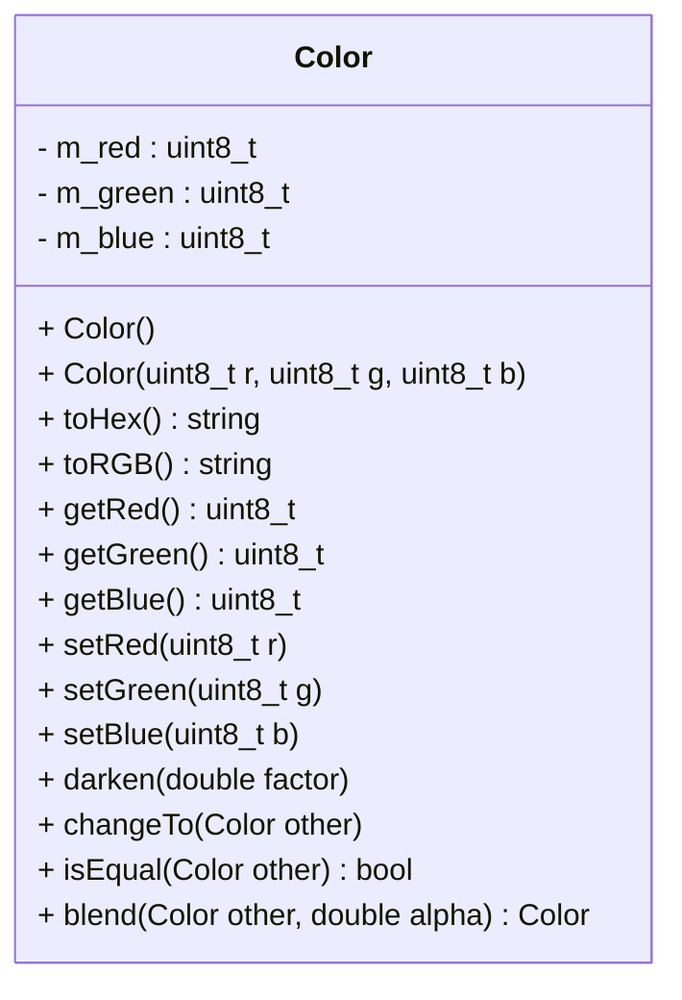

```mermaid
classDiagram
  class Color {
    - m_red : uint8_t
    - m_green : uint8_t
    - m_blue : uint8_t

    + Color()
    + Color(uint8_t r, uint8_t g, uint8_t b)

    + toHex() string
    + toRGB() string

    + getRed() uint8_t
    + getGreen() uint8_t
    + getBlue() uint8_t

    + setRed(uint8_t r) 
    + setGreen(uint8_t g) 
    + setBlue(uint8_t b) 

    + darken(double factor) 

    + changeTo(Color other) 

    + isEqual(Color other) bool

    + blend(Color other, double alpha) Color
  }
```